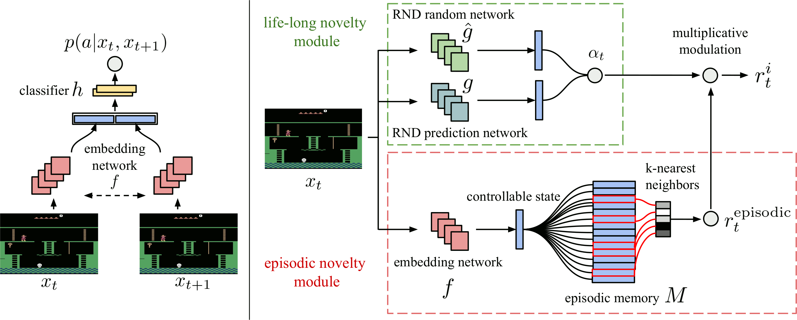
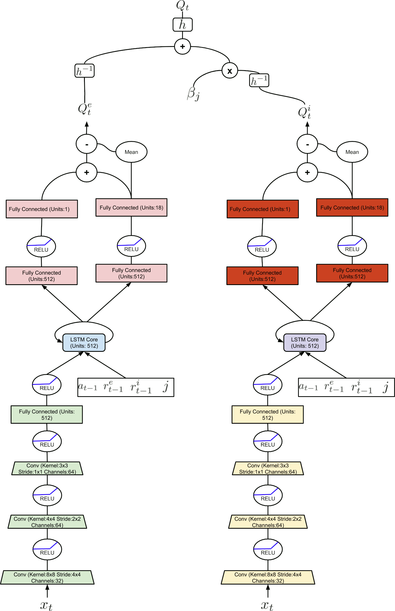

title: NPFL139, Lecture 9
class: title, langtech, cc-by-sa
# Transformed Rewards, R2D2, Agent57, MERLIN

## Milan Straka

### April 14, 2026

---
section: PopArt
class: section
# PopArt Normalization

---
style: .katex-display { margin: .9em 0 }
# PopArt Normalization

An improvement of IMPALA from Sep 2018, which performs normalization of task
rewards instead of just reward clipping. PopArt stands for _Preserving Outputs
Precisely, while Adaptively Rescaling Targets_.

~~~
Assume the value estimate $v(s; →θ, σ, μ)$ is computed using a normalized value
predictor $n(s; →θ)$
$$v(s; →θ, σ, μ) ≝ σ n(s; →θ) + μ,$$
and further assume that $n(s; →θ)$ is an output of a linear function
$$n(s; →θ) ≝ →ω^\T f(s; →θ-\{→ω, b\}) + b.$$

~~~
We can update the $σ$ and $μ$ using exponentially moving average with decay rate
$β$ (in the paper, the first moment $μ$ and the second moment $υ$ are tracked, and
the standard deviation is computed as $σ=\sqrt{υ-μ^2}$ following
$\Var X = 𝔼[X^2] - (𝔼X)^2$; decay rate $β=3 ⋅ 10^{-4}$ is employed).

---
# PopArt Normalization

Utilizing the parameters $μ$ and $σ$, we can normalize the observed (unnormalized) returns as
$(G - μ) / σ$, and use an actor-critic algorithm with advantage $(G - μ)/σ - n(S; →θ)$.

~~~
However, in order to make sure the value function estimate does not change when
the normalization parameters change, the parameters $→ω, b$ used to compute the
value estimate
$$v(s; →θ, σ, μ) ≝ σ ⋅ \Big(→ω^\T f(s; →θ-\{→ω, b\}) + b\Big) + μ$$
are updated under any change $μ → μ'$ and $σ → σ'$ as
$$\begin{aligned}
  →ω' &← \frac{σ}{σ'}→ω,\\
  b' &← \frac{σb + μ - μ'}{σ'}.
\end{aligned}$$

~~~
In multi-task settings, we train a task-agnostic policy and task-specific value
functions (therefore, $→μ$, $→σ$, and $→n(s; →θ)$ are vectors).

---
# PopArt Results

~~~

---
# PopArt Results

Normalization statistics on chosen environments.

---
section: TransRews
class: section
# Transformed Rewards

---
# Transformed Rewards

So far, we have clipped the rewards in DQN on Atari environments.

~~~
Consider a Bellman operator $𝓣$
$$(𝓣q)(s, a) ≝ 𝔼_{s',r ∼ p} \Big[r + γ \max_{a'} q(s', a')\Big].$$

~~~
Instead of clipping the magnitude of rewards, we might use a function
$h \colon ℝ → ℝ$ to reduce their scale. We define a transformed Bellman operator
$𝓣_h$ as
$$(𝓣_hq)(s, a) ≝ 𝔼_{s',r ∼ p} \Big[h\Big(r + γ \max_{a'} h^{-1} \big(q(s', a')\big)\Big)\Big].$$

---
# Transformed Rewards

It is easy to prove the following two propositions from a 2018 paper
_Observe and Look Further: Achieving Consistent Performance on Atari_ by Tobias
Pohlen et al.

~~~
1. If $h(z) = α z$ for $α > 0$, then $𝓣_h^k q \xrightarrow{k → ∞} h \circ q_* = α q_*$.

~~~
   The statement follows from the fact that it is equivalent to scaling the
   rewards by a constant $α$.

~~~
2. When $h$ is strictly monotonically increasing and the MDP is deterministic,
   then $𝓣_h^k q \xrightarrow{k → ∞} h \circ q_*$.

~~~
   This second proposition follows from
   $$h \circ q_* = h \circ 𝓣 q_* = h \circ 𝓣(h^{-1} \circ h \circ q_*) = 𝓣_h(h \circ q_*),$$
   where the last equality only holds if the MDP is deterministic.

---
# Transformed Rewards

For stochastic MDP, the authors prove that if $h$ is strictly monotonically
increasing, Lipschitz continuous with Lipschitz constant $L_h$, and has a
Lipschitz continuous inverse with Lipschitz constant $L_{h^{-1}}$, then
for $γ < \frac{1}{L_h L_{h^{-1}}}$, $𝓣_h$ is again a contraction. (Proof
in Proposition A.1.)

~~~
For the Atari environments, the authors propose the transformation
$$h(x) ≝ \sign(x)\left(\sqrt{|x| + 1} - 1\right) + εx$$
with $ε = 10^{-2}$. The additive regularization term ensures that
$h^{-1}$ is Lipschitz continuous.

~~~
It is straightforward to verify that
$$h^{-1}(x) = \sign(x)\left(\left(\frac{\sqrt{1 + 4ε (|x| + 1 + ε)} - 1}{2ε} \right)^2 - 1\right).$$

~~~
In practice, discount factor larger than $\frac{1}{L_h L_{h^{-1}}}$ is being
used; however, it seems to work.

---
# Transformed Rewards

---
section: R2D2
class: section
# Recurrent Replay Distributed DQN (R2D2)

---
# Recurrent Replay Distributed DQN (R2D2)

Proposed in 2019, to study the effects of recurrent state, experience replay and
distributed training.

~~~
R2D2 utilizes prioritized replay, $n$-step double Q-learning with $n=5$,
convolutional layers followed by a 512-dimensional LSTM passed to duelling
architecture, generating experience by a large number of actors (256; each
performing approximately 260 steps per second) and learning from batches in
a single learner (achieving 5 updates per second using mini-batches of 64
sequences of length 80).

~~~
Rewards are transformed instead of clipped, and no loss-of-life-as-episode-end
heuristic is used.

~~~
Instead of individual transitions, the replay buffer consists of fixed-length
($m=80$) sequences of $(s, a, r)$, with adjacent sequences overlapping by 40
time steps.

~~~
The prioritized replay employs a combination of the maximum and the average
absolute 5-step TD errors $δ_i$ over the sequence: $p = η \max_i δ_i + (1 - η)
δ̄$, for both $η$ and the priority exponent set to 0.9.

~~~
Several R2D2 agent videos are available at https://bit.ly/r2d2600.

---
# Recurrent Replay Distributed DQN (R2D2)

When running the recurrent network on a sequence from the replay buffer, two
strategies of initializing the hidden state are considered:
~~~
- **stored-state** uses the hidden state from the training;
- **zero-state** uses 0.

~~~
Furthermore, an optional burn-in of length 0, 20, and 40 (before the 80 states
used during training; only used for obtaining better hidden state) is considered.

~~~
The stored-state and burn-in of length 40 is used during evaluation.

---
# Recurrent Replay Distributed DQN (R2D2)

---
# Recurrent Replay Distributed DQN (R2D2)

---
# Recurrent Replay Distributed DQN (R2D2)

---
# Recurrent Replay Distributed DQN (R2D2)

Ablations comparing the reward clipping instead of value rescaling
(**Clipped**), smaller discount factor $γ = 0.99$ (**Discount**)
and **Feed-Forward** variant of R2D2. Furthermore, life-loss
**reset** evaluates resetting an episode on life loss, with
**roll** preventing value bootstrapping (but not LSTM unrolling).

---
# Utilization of LSTM Memory During Inference

The effect of restricting the policy to $k$ steps only (using either
the zero-state or stored-state initialization). While Ms.Pacman is
fully observable, EmstmWatermaze strongly requires the use of memory.

---
class: section
# Agent57

---
# Agent57

The Agent57 is an agent (from Mar 2020) capable of outperforming the standard
human benchmark on all 57 games.

~~~
Its most important components are:
- Retrace; from _Safe and Efficient Off-Policy Reinforcement Learning_ by Munos
  et al., https://arxiv.org/abs/1606.02647,
~~~
- Never give up strategy; from _Never Give Up: Learning Directed Exploration Strategies_
  by Badia et al., https://arxiv.org/abs/2002.06038,
~~~
- Agent57 itself; from _Agent57: Outperforming the Atari Human Benchmark_ by
  Badia et al., https://arxiv.org/abs/2003.13350.

---
section: Retrace
class: section
# Retrace

---
# Retrace

$\displaystyle \mathrlap{𝓡q(s, a) ≝ q(s, a) + 𝔼_b \bigg[∑_{t≥0} γ^t \left(∏\nolimits_{j=1}^t c_j\right)
  \Big(R_{t+1} + γ𝔼_{A_{t+1} ∼ π} q(S_{t+1}, A_{t+1}) - q(S_t, A_t)\Big)\bigg],}$

where there are several possibilities for defining the traces $c_t$:
~~~
- **importance sampling**, $c_t = ρ_t = \frac{π(A_t|S_t)}{b(A_t|S_t)}$,
  - the usual off-policy correction, but with possibly very high variance,
  - note that $c_t = 1$ in the on-policy case;
~~~
- **Tree-backup TB(λ)**, $c_t = λ π(A_t|S_t)$,
  - the Tree-backup algorithm extended with traces,
  - however, $c_t$ can be much smaller than 1 in the on-policy case;
~~~
- **Retrace(λ)**, $c_t = λ \min\big(1, \frac{π(A_t|S_t)}{b(A_t|S_t)}\big)$,
  - off-policy correction with limited variance, with $c_t = 1$ in the on-policy case.

~~~
The authors prove that $𝓡$ has a unique fixed point $q_π$ for any
$0 ≤ c_t ≤ \frac{π(A_t|S_t)}{b(A_t|S_t)}$.

---
section: NGU
class: section
# Never Give Up

---
# Never Give Up

The NGU (Never Give Up) agent performs _curiosity-driver exploration_, and
augment the extrinsic (MDP) rewards with an intrinsic reward. The augmented
reward at time $t$ is then $r_t^β ≝ r_t^e + β r_t^i$, with $β$ a scalar
weight of the intrinsic reward.

~~~
The intrinsic reward fulfills three goals:

~~~
1. quickly discourage visits of the same state in the same episode;

~~~
2. slowly discourage visits of the states visited many times in all episodes;

~~~
3. ignore the parts of the state not influenced by the agent's actions.

~~~
The intrinsic rewards is a combination of the episodic novelty $r_t^\textrm{episodic}$
and life-long novelty $α_t$:
$$r_t^i ≝ r_t^\textrm{episodic} ⋅ \operatorname{clip}\Big(1 ≤ α_t ≤ L=5\Big).$$

---
style: .katex-display { margin: .5em 0 }
# Never Give Up

The episodic novelty works by storing the embedded states $f(S_t)$ visited
during the episode in episodic memory $M$.

~~~
The $r_t^\textrm{episodic}$ is then estimated as

$$r_t^\textrm{episodic} = \frac{1}{\sqrt{\textrm{visit~count~of~}f(S_t)}}.$$

~~~
The visit count is estimated using similarities of $k$-nearest neighbors of $f(S_t)$
measured via an inverse kernel $K(x, z) = \frac{ε}{\frac{d(x, z)^2}{d_m^2} + ε}$ for
$d_m$ a running mean of the $k$-nearest neighbor distance:

$$r_t^\textrm{episodic} = \frac{1}{\sqrt{∑\nolimits_{f_i ∈ N_k} K(f(S_t), f_i)}+c}\textrm{,~~with~pseudo-count~c=0.001}.$$

---
# Never Give Up

The state embeddings are trained to ignore the parts not influenced by the actions of the agent.

~~~

To this end, Siamese network $f$ is trained to predict $p(A_t|S_t, S_{t+1})$,
i.e., the action $A_t$ taken by the agent in state $S_t$ when the resulting
state is $S_{t+1}$.

~~~
The life-long novelty $α_t=1 + \tfrac{\|ĝ - g\|^2 - μ_\textrm{err}}{σ_\textrm{err}}$
is trained using random network distillation (RND),
where a predictor network $ĝ$ tries to predict the output of an untrained
convolutional network $g$ by minimizing the mean squared error; the
$μ_\textrm{err}$ and $σ_\textrm{err}$ are the running mean and standard
deviation of the error $\|ĝ-g\|^2$.

---
# Never Give Up

The NGU agent is based on R2D2 with transformed Retrace loss and augmented reward
$$r_t^i ≝ r_t^\textrm{episodic} ⋅ \operatorname{clip}\Big(1 ≤ α_t ≤ L=5\Big).$$

~~~

To support multiple policies concentrating either on the extrinsic or the
intrinsic reward, the NGU agent trains a parametrized action-value function $q(s, a, β_i)$
which corresponds to reward $r_t^{β_i} = r_t^e + β_ir_t^i$ for $β_0=0$ and $γ_0=0.997$, …, $β_{N-1}=β$
and $γ_{N-1}=0.99$.

For evaluation, $q(s, a, 0)$ is employed.

---
# Never Give Up

---
# Never Give Up Ablations

---
section: Agent57
class: section
# Agent57

---
# Agent57

The Agent57 is an agent (from Mar 2020) capable of outperforming the standard
human benchmark on all 57 games.

~~~
Its most important components are:
- Retrace; from _Safe and Efficient Off-Policy Reinforcement Learning_ by Munos
  et al., https://arxiv.org/abs/1606.02647,
~~~
- Never give up strategy; from _Never Give Up: Learning Directed Exploration Strategies_
  by Badia et al., https://arxiv.org/abs/2002.06038,
~~~
- Agent57 itself; from _Agent57: Outperforming the Atari Human Benchmark_ by
  Badia et al., https://arxiv.org/abs/2003.13350.

---
# Agent57

Then Agent57 improves NGU with:
~~~
- splitting the action-value as $q(s, a, j; →θ) ≝ q(s, a, j; →θ^e) + β_j q(s, a, j; →θ^i)$, where
  - $q(s, a, j; →θ^e)$ is trained with $r_e$ as targets, and
  - $q(s, a, j; →θ^i)$ is trained with $r_i$ as targets.
~~~
- instead of considering all $(β_j, γ_j)$ equal, we train a meta-controller
  using a non-stationary multi-arm bandit algorithm, where arms correspond
  to the choice of $j$ for a whole episode (so an actor first samples a $j$
  using multi-arm bandit problem and then updates it according to the observed
  return), and the reward signal is the undiscounted extrinsic episode return;
  each actor uses different $ε_l$-greedy behavior;
~~~
- $γ_{N-1}$ is increased from $0.997$ to $0.9999$;
~~~
- 160-transition episodes are sampled from the replay buffer.

---
# Agent57 – Results

---
# Agent57 – Ablations

---
section: MERLIN
class: section
# MERLIN

---
# MERLIN

In a partially-observable environment, keeping all information in the RNN state
is substantially limiting. Therefore, _memory-augmented_ networks can be used to
store suitable information in external memory (in the lines of NTM, DNC, or MANN
models).

We now describe an approach used by Merlin architecture (_Unsupervised
Predictive Memory in a Goal-Directed Agent_ DeepMind Mar 2018 paper).

---
# MERLIN – Memory Module

Let $→M$ be a memory matrix of size $N_\textit{mem} × 2|→e|$.

~~~
Assume we have already encoded observations as $→e_t$ and previous action
$a_{t-1}$. We concatenate them with $K$ previously read vectors and process
them by a deep LSTM (two layers are used in the paper) to compute $→h_t$.

~~~
Then, we apply a linear layer to $→h_t$, computing $K$ key vectors
$→k_1, …, →k_K$ of length $2|→e|$ and $K$ positive scalars $β_1, …, β_K$.

~~~
**Reading:** For each $i$, we compute cosine similarity of $→k_i$ and all memory
rows $→M_j$, multiply the similarities by $β_i$ and pass them through a $\softmax$
to obtain weights $→ω_i$. The read vector is then computed as $⇉M →ω_i$.

~~~
**Writing:** We find one-hot write index $→v_\textit{wr}$ to be the least used
memory row (we keep usage indicators and add read weights to them). We then
compute $→v_\textit{ret} ← γ →v_\textit{ret} + (1 - γ) →v_\textit{wr}$,
and retroactively update the memory matrix using
$⇉M ← ⇉M + →v_\textit{wr}[→e_t, 0] + →v_\textit{ret}[0, →e_t]$.

---
# MERLIN — Prior and Posterior

However, updating the encoder and memory content purely using RL is inefficient.
Therefore, MERLIN includes a _memory-based predictor (MBP)_ in addition to policy.
The goal of MBP is to compress observations into low-dimensional state
representations $→z$ and storing them in memory.

~~~
We want the state variables not only to faithfully represent the data, but also
emphasise rewarding elements of the environment above irrelevant ones. To
accomplish this, the authors follow the hippocampal representation theory of
Gluck and Myers, who proposed that hippocampal representations pass through
a compressive bottleneck and then reconstruct input stimuli together with task
reward.

~~~
In MERLIN, a (Gaussian diagonal) _prior_ distribution over $→z_t$ predicts next state variable
conditioned on history of state variables and actions
$p(→z_t^\textrm{prior} | →z_{t-1}, a_{t-1}, …, →z_1, a_1)$,
and _posterior_ corrects the prior using the new observation $→o_t$, forming
a better estimate $q(→z_t | →o_t, →z_t^\textrm{prior}, →z_{t-1}, a_{t-1}, …, →z_1, a_1) + →z_t^\textrm{prior}$.

---
# MERLIN — Prior and Posterior

To achieve the mentioned goals, we add two terms to the loss.

- We try reconstructing input stimuli, action, reward and return using a sample from
  the state variable posterior, and add the difference of the reconstruction and
  ground truth to the loss.

~~~
- We also add KL divergence of the prior and the posterior to the loss, to ensure
  consistency between the prior and the posterior.

~~~

---
# MERLIN — Algorithm

---
# MERLIN

---
# MERLIN

---
# MERLIN

---
section: CTF-FTW
# For the Win agent for Capture The Flag

---
# For the Win agent for Capture The Flag

- Extension of the MERLIN architecture.

~~~
- Hierarchical RNN with two timescales.

~~~
- V-Trace with both clipping factors set to 1 is used.

~~~
- Rewards for 13 pre-defined events (picking a flag, returning a flag, tagging/being tag with/without a flag, …) are learned by the agent.

~~~
- Population based training controlling KL divergence penalty weights,
  internal dense rewards, slow ticking RNN speed, and gradient flow factor from
  fast to slow RNN.

  In every game, teams of similarly skilled agents were selected, and the
  authors state it is crucial to employ several agents instead of just one
  (30 simultaneously trained agents are used).

---
# For the Win agent for Capture The Flag

---
class: middle
# For the Win agent for Capture The Flag

---
class: middle
# For the Win agent for Capture The Flag

---
# For the Win agent for Capture The Flag

